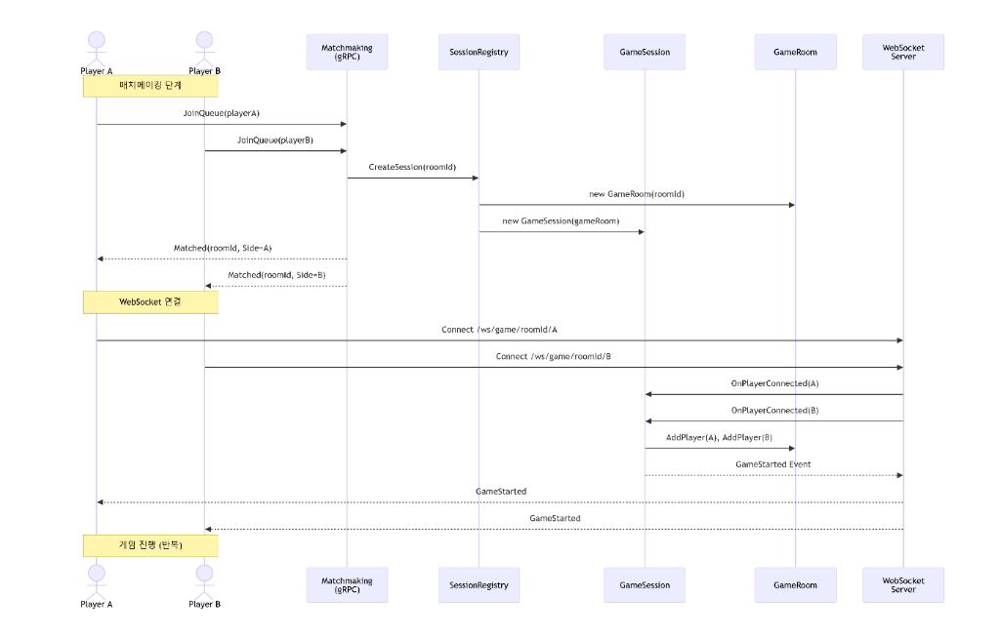

# HexWar (C# HaxWar)

**HexWar**는 gRPC 매치메이킹과 WebSocket 실시간 통신을 활용하여 구현된 **C# .NET 기반의 실시간 동시 턴제(Simultaneous Turn) 멀티플레이어 전략 게임 백엔드**입니다. 

플레이어는 노드와 간선으로 이루어진 전장에서 유닛을 이동하고, 보급로를 활성화하며, 본부(HQ) 시야를 확보하여 정보 비대칭 우위를 점해야 합니다. 양 플레이어가 동시에 명령을 내리고 일괄 해소되는 시스템, 간선 위에서 발생하는 조우(Encounter) 심리전 등 독창적인 도메인 규칙을 정교하게 제어합니다.

---

## 주요 아키텍처 및 핵심 기능

- **동시 턴제 & 일괄 해소**: 플레이어들의 이동 예약을 `PendingMoves`로 관리하여 자원 이중 사용을 방지하고, 라운드 종료 시 해소되는 구조입니다.
- **보급로 및 거점 수비대**: 전략적 보급 노드 점령 시 자동으로 고정 수비대가 생성 및 소멸하는 제어 로직을 제공합니다.
- **본부 시야 및 가시성 필터링**: HQ 장악 여부에 따라 상대방 정보를 동적으로 제한하며, 패킷 유출을 막는 계층형 필터링을 구현했습니다.
- **네트워크 최적화**: 개별 소켓 호출 대신 라운드 해소 결과를 통합 이벤트(`RoundResolved`)로 배치 전송하며, `CircularBuffer` 기반의 이벤트 로그 버퍼를 두어 재연결 시 누락 이벤트를 자동으로 복구합니다.
- **자원 누수 방지**: OS 타이머 핸들 및 WebSocket 세션 누수를 방지하기 위한 이중 동기화와 `IDisposable` 패턴의 정리 로직을 준수합니다.


## 전체적 게임 흐름



# 기술적 도전 및 최적화

## 1. 시계열 이동 및 조우 판정 관리

### 게임 컨텍스트

유닛은 노드 간 간선(Edge)을 따라 이동하며, 간선의 `Distance`에 따라 도착까지 1~2라운드가 소요됩니다.
이동 명령은 Planning 단계에서 예약(`PendingMoves`)되고, 라운드가 해소(`ResolveRound`)될 때 일괄 실행됩니다.
두 플레이어의 유닛이 동일 간선 위에서 마주치면 "조우"가 발생하며, 각 플레이어는 **진격 또는 후퇴**를 결정해야 합니다.

---


### 기술적 문제 및 접근

이 구조에서 두 가지 문제가 발생합니다.

- **조우 판정** — 같은 간선 위에서 이동 중인 서로 다른 플레이어의 유닛이 같은 라운드에 도달하는 시점이 일치할 경우 조우가 발생합니다.
- **이동 갱신** — 라운드가 경과할 때마다 각 유닛의 남은 이동 거리를 1씩 감소합니다.

단순 리스트로 이를 구현하면 다음 두 가지 부작용이 발생합니다.

- **메모리 관리의 불편성** — 거리가 10인 간선에서 유닛이 이동할 때 10개의 빈 인덱스가 생깁니다. 이를 정리하기 위한 압축 로직과 인덱스 이동 처리 등 불필요한 연산 비용이 발생합니다. SortedList는 남은 라운드 수를 Key로 하여 이동 중인 유닛을 보관하므로, 중간 빈 인덱스를 따로 관리할 필요 없이 이동 시퀀스를 간결하게 표현할 수 있었습니다.

- **직관적인 라운드 해소 처리** — 인덱스 방식의 경우 리스트 요소들을 한 칸씩 앞으로 당기는 Shift 연산이 필요하며, 인덱스 오프셋 관리 등 비즈니스 로직과 무관한 비용이 발생합니다. SortedList는 `Key - 1`이라는 명시적인 시계열 연산으로 새 컬렉션에 재매핑하므로, 코드를 직관적으로 작성할 수 있었습니다.

---

### 행동 : `SortedList<int, List<TravelingGroup>>`

**자료구조 비교**

| 자료구조 | `List<List<TravelingGroup>>` (인덱스 매핑) | `SortedList<int, List<T>>` (Key 매핑) |
|---|---|---|
| **메모리** | 거리가 멀어질수록 빈 공간 패딩으로 메모리 낭비 발생 | 유닛이 존재하는 라운드만 데이터 유지 (Sparse 최적화) |
| **안전성** | 리스트 크기 초과 시 OutOfRange 예외 관리 필요 | Key 존재 여부 체크만으로 예외 없이 동적 추가 가능 |
| **가독성** | 인덱스 연산(`list[i]`)으로 인해 도메인 규칙 파악이 간접적 | Key 자체가 남은 라운드를 의미하므로 의미론적으로 명확 |

핵심 도메인 타입은 `TravelingGroup`은 세 가지 정보를 보유하도록 하였습니다.

```csharp
// src/HexWar.Domain/Entities/TravelingGroup.cs
public class TravelingGroup
{
    public PlayerSide Side { get; }    // 소유 플레이어
    public int UnitCount { get; }      // 유닛 수
    public NodeId Destination { get; } // 목적지 (적에게는 비공개)
}
```

`Edge`객체 내부의 `TravelingUnits`는 이동 중인 유닛 그룹을 **남은 라운드 수**를 Key로 묶어 관리하였습니다.

```csharp
// src/HexWar.Domain/Entities/Edge.cs
public SortedList<int, List<TravelingGroup>> TravelingUnits { get; } = new();
```

```
TravelingUnits: SortedList<int, List<TravelingGroup>>
┌─────────────────────────────────────────────────────────┐
│  Key (남은 라운드)  │  Value (이동 중인 유닛 그룹)      │
├─────────────────────┼────────────────────────────────────┤
│        1            │  [PlayerA: 2기 → N4]               │
│                     │  [PlayerB: 1기 → N1]  ← 조우 발생! │
├─────────────────────┼────────────────────────────────────┤
│        2            │  [PlayerA: 1기 → N4]               │
└─────────────────────┴────────────────────────────────────┘
         ↑
    Key 기준 자동 오름차순 정렬
    (도착 임박 유닛이 항상 앞에 위치)
```


---

### 키 불변성 문제와 재구성

SortedList의 키는 변경할 수 없습니다. 기존 엔트리에 `key--` 연산을 직접 적용하는 것이 불가능하기때문에 명시적으로 라운드가 경과할 때마다 **새 SortedList를 완전히 재구성**합니다.

```csharp
// src/HexWar.Domain/Entities/Edge.cs
public List<TravelingGroup> AdvanceRound()
{
    var arrived = new List<TravelingGroup>();
    var newTraveling = new SortedList<int, List<TravelingGroup>>(); // ← 새 구조 생성

    foreach (var kvp in TravelingUnits)
    {
        int newRemaining = kvp.Key - 1;

        if (newRemaining <= 0)
            arrived.AddRange(kvp.Value);   // Key 0 → 도착 처리
        else
        {
            if (!newTraveling.ContainsKey(newRemaining))
                newTraveling[newRemaining] = new List<TravelingGroup>();
            newTraveling[newRemaining].AddRange(kvp.Value);
        }
    }

    TravelingUnits.Clear();
    foreach (var kvp in newTraveling)
        TravelingUnits[kvp.Key] = kvp.Value;

    return arrived;
}
```

```
[라운드 5] → [라운드 6]

Before:                           After (newTraveling):
┌─────────────────────┐           ┌─────────────────────┐
│ Key 2: [A:2기→N4]   │  재구성   │ Key 1: [A:2기→N4]   │ ← Key-1
│        [B:1기→N1]   │  ──────►  │        [B:1기→N1]   │
├─────────────────────┤           ├─────────────────────┤
│ Key 3: [A:1기→N4]   │           │ Key 2: [A:1기→N4]   │ ← Key-1
├─────────────────────┤           ├─────────────────────┤
│ Key 5: [B:2기→N1]   │           │ Key 4: [B:2기→N1]   │ ← Key-1
└─────────────────────┘           └─────────────────────┘
```


---

### 조우 판정 흐름

`ResolveRound()` 3단계에서 모든 간선의 조우를 탐색합니다.

```csharp
// src/HexWar.Domain/Entities/Edge.cs
public List<EncounterInfo> FindAllEncounters()
{
    var encounters = new List<EncounterInfo>();

    foreach (var kvp in TravelingUnits)
    {
        // 동일 Key에 서로 다른 Side가 존재하면 조우
        if (HasEncounter(kvp.Key, out var groups) && groups != null)
        {
            var groupA = groups.FirstOrDefault(g => g.Side == PlayerSide.A);
            var groupB = groups.FirstOrDefault(g => g.Side == PlayerSide.B);

            if (groupA != null && groupB != null)
                encounters.Add(new EncounterInfo(Id, groupA, groupB, kvp.Key));
        }
    }
    return encounters;
}

public bool HasEncounter(int roundRemaining, out List<TravelingGroup>? groups)
{
    if (TravelingUnits.TryGetValue(roundRemaining, out groups) && groups.Count > 1)
    {
        var sides = groups.Select(g => g.Side).Distinct();
        return sides.Count() > 1; // 두 플레이어가 동일 Key에 존재
    }
    groups = null;
    return false;
}
```

조우가 감지되면 `PendingEncounters`에 등록되고, 플레이어들은 다음 Planning 단계에서 **진격(Advance)** 또는 **후퇴(Retreat)**를 결정합니다.

**후퇴 처리:**
후퇴를 선택하면 `GetOppositeNode()`로 방향을 반전하여 출발지를 새 목적지로 삼아 `StartTravel()`을 다시 호출합니다.
기존 그룹은 `RemoveTravelingGroup()`으로 제거하고, 새 Key로 재등록됩니다.

```csharp
// src/HexWar.Domain/Entities/GameRoom.Events.cs
NodeId retreatDestination = edge.Id.GetOppositeNode(decidingGroup.Destination);
edge.RemoveTravelingGroup(deciderSide);
edge.StartTravel(deciderSide, decidingGroup.UnitCount, retreatDestination);
```

**타임아웃 자동 처리:**
Planning 타이머(30초)가 만료되면 미결정 조우는 자동으로 `Retreat`으로 처리됩니다.

```csharp
// src/HexWar.Application/Sessions/GameSession.cs
var undecided = _gameRoom.GetUndecidedEncounters(side);
foreach (var enc in undecided)
    _gameRoom.ResolveEncounter(enc.EdgeId, side, EncounterDecision.Retreat);
```


## 2. CircularBuffer를 활용한 이벤트 로그 관리

### 게임 컨텍스트

서버는 WebSocket을 통해 도메인 이벤트를 실시간으로 브로드캐스트합니다.
네트워크 불안정으로 클라이언트가 잠시 끊겼다 재연결할 경우, 누락된 이벤트를 복구 해야하였습니다. 

---

### CircularBuffer 구조와 동작

`GameSession`객체의 `CircularBuffer<BufferedEvent>`는 기록할 이벤트의 범위만큼 버퍼의 크기를 지정할 수 있도록 구현하였습니다.

```csharp
// src/HexWar.Application/Sessions/GameSession.cs
private readonly CircularBuffer<BufferedEvent> _eventBuffer = new(200);
private long _eventSequence = 0;
```

각 `BufferedEvent`는 시퀀스 번호, 이벤트 객체, 타임스탬프를 포함합니다.

```csharp
// src/HexWar.Application/Sessions/CircularBuffer.cs
public class BufferedEvent
{
    public long SequenceNumber { get; init; }
    public object Event { get; init; } = null!;
    public DateTime Timestamp { get; init; }
}
```

내부 구조는 고정 크기 배열과 `_head` 포인터로 이루어집니다.
버퍼가 꽉 찬 상태에서 새 항목이 추가되면 `_head`가 가장 오래된 위치를 덮어씁니다.
내부 순환 처리를 위해 **Modulo 연산**을 사용하여 용량 외 인덱스에 접근하는 문제를 방지하였습니다.

```
capacity = 8, 6개 항목 기록 후 상태:

  index:  0    1    2    3    4    5    6    7
        ┌────┬────┬────┬────┬────┬────┬────┬────┐
        │ e1 │ e2 │ e3 │ e4 │ e5 │ e6 │    │    │
        └────┴────┴────┴────┴────┴────┴────┴────┘
                                        ↑
                                      _head (다음 쓰기 위치)

추가 3개 후 (버퍼 포화, 덮어쓰기 시작):

  index:  0    1    2    3    4    5    6    7
        ┌────┬────┬────┬────┬────┬────┬────┬────┐
        │ e9 │ e2 │ e3 │ e4 │ e5 │ e6 │ e7 │ e8 │
        └────┴────┴────┴────┴────┴────┴────┴────┘
         ↑
       _head (e1 덮어씀)

읽기는 _head부터 시작하여 순서대로 순회:
  e2 → e3 → e4 → e5 → e6 → e7 → e8 → e9
```

삽입은 `_head = (_head + 1) % capacity`로 처리되므로 **쓰기가 O(1)**입니다.

```csharp
// src/HexWar.Application/Sessions/CircularBuffer.cs
public void Add(T item)
{
    lock (_lock)
    {
        _buffer[_head] = item;
        _head = (_head + 1) % _buffer.Length;  // 모듈러 연산으로 순환
        if (_count < _buffer.Length) _count++;  // 포화 시 _count 고정
    }
}
```

**자료구조 비교**

| 연산 | CircularBuffer | List | ConcurrentQueue |
|---|---|---|---|
| 쓰기 | O(1) | O(1)* | O(1) |
| 읽기 (필터) | O(n) | O(n) | O(n) — 복사 필요 |
| 메모리 상한 | 고정 (200) | 무제한 | 무제한 |
| 순차 인덱스 접근 | 가능 | 가능 | 불가 (열거만) |
| Thread-safe | 직접 구현 | 직접 구현 | 내장 |

"메모리 상한 + 순차 인덱스 접근"이 동시에 필요한 이 구조에는 **CircularBuffer** 원형 리스트를 사용하는 것이 적절하다고 판단하였습니다. 

---

### 재연결 시나리오 — `GetEventsAfter()`

클라이언트는 마지막으로 수신한 시퀀스 번호를 서버에 전달합니다.
서버는 그 이후의 이벤트만 추출하여 순서대로 반환합니다.

```csharp
// src/HexWar.Application/Sessions/GameSession.cs
public List<BufferedEvent> GetEventsAfter(long lastSeenSequence)
{
    return _eventBuffer
        .Where(e => e.SequenceNumber > lastSeenSequence)
        .OrderBy(e => e.SequenceNumber)
        .ToList();
}
```

`CircularBuffer<T>`가 `IEnumerable<T>`를 구현하기 때문에 LINQ를 그대로 사용할 수 있습니다.
`Where()` 내부에서는 읽기 순서를 맞추기 위해 `_head`를 시작점으로 삼아 순환 순회합니다.

```
재연결 흐름:

  클라이언트                    서버 (GameSession)
      │                              │
      │  Reconnect(lastSeq=47)       │
      │─────────────────────────────►│
      │                              │  _eventBuffer.Where(e => e.SeqNo > 47)
      │                              │  → [e48, e49, e50, e51]
      │  MissedEvents([e48..e51])    │
      │◄─────────────────────────────│
      │                              │
```

---

### Thread Safety — 이중 동기화 전략

이벤트 발행에는 두 가지 경합 지점이 있습니다.

**1. 시퀀스 번호 발급** — `Interlocked.Increment`로 원자적 증가를 보장합니다.
락 없이 CAS(Compare-And-Swap) 연산만으로 처리되어 오버헤드가 없습니다.

```csharp
// src/HexWar.Application/Sessions/GameSession.cs
var sequenceNumber = Interlocked.Increment(ref _eventSequence);
```

**2. 버퍼 쓰기/읽기** — `CircularBuffer` 내부의 `lock`으로 보호합니다.
`_head`와 `_count` 갱신이 원자적으로 이루어져야 하기 때문입니다.

```csharp
// src/HexWar.Application/Sessions/CircularBuffer.cs
public void Add(T item)
{
    lock (_lock) { /* _head, _count 동시 갱신 */ }
}

public List<T> Where(Func<T, bool> predicate)
{
    lock (_lock) { /* 순회 도중 _head 이동 방지 */ }
}
```

---

## 3. IDisposable을 통한 명시적 자원 해제

### 자원의 두 종류

`GameSession`은 두 종류의 자원을 보유합니다.

**OS 자원 (Unmanaged)** — GC가 수거하지 않으며, 해제하지 않으면 프로세스 전체에서 점유됩니다.

| 자원 | 타입 | 미해제 시 영향 |
|---|---|---|
| Planning 타이머 | `System.Timers.Timer` | OS 타이머 핸들 누수, 세션 종료 후에도 콜백 실행 |
| 동기화 객체 | `SemaphoreSlim` | 내부 `WaitHandle`(OS 커널 오브젝트) 누수 |
| WebSocket | `System.Net.WebSockets.WebSocket` | 소켓 디스크립터 유지, TCP 연결 미종료 |

**애플리케이션 자원 (Managed)** — GC가 수거하지만, 즉시 해제하지 않으면 문제가 발생합니다.

| 자원 | 타입 | 즉시 해제가 필요한 이유 |
|---|---|---|
| 이벤트 버퍼 | `CircularBuffer<BufferedEvent>` | 이벤트 객체의 역참조를 끊어 GC 수거를 앞당김 |
| 이벤트 핸들러 | `OnGameOver`, `OnRoundResolved` | 구독자가 세션을 참조하여 GC 수거 방지 |

---

### `GameSession.Dispose()` — 자원 해제 순서

해제 순서는 의존 관계를 고려해야 합니다.
타이머를 먼저 중단하지 않으면, 타이머 콜백이 이미 해제된 `_lock`에 접근할 수 있습니다.

```csharp
// src/HexWar.Application/Sessions/GameSession.cs
public void Dispose()
{
    StopPlanningTimer();   // 1. OS 타이머 콜백 차단 (가장 먼저)
    _eventBuffer.Dispose(); // 2. 버퍼 배열 내용 지우기 (이벤트 객체 역참조 해제)
    _lock.Dispose();        // 3. SemaphoreSlim의 WaitHandle 해제

    // 4. 이벤트 핸들러 구독 해제 (SessionRegistry 등의 역참조 차단)
    OnGameOver = null;
    OnRoundResolved = null;
}

private void StopPlanningTimer()
{
    _planningTimer?.Stop();    // 타이머 중단
    _planningTimer?.Dispose(); // OS 타이머 핸들 해제
    _planningTimer = null;
}
```

---

### `CircularBuffer.Dispose()` — 배열 역참조 해제

`CircularBuffer`는 고정 크기 배열을 내부에 보유합니다.
버퍼가 담고 있는 `BufferedEvent` 객체들은 도메인 이벤트(`IDomainEvent`)를 참조합니다.
`Dispose()`에서 배열을 명시적으로 비우면 해당 이벤트 객체들에 대한 역참조가 즉시 끊어집니다.

```csharp
// src/HexWar.Application/Sessions/CircularBuffer.cs
public void Dispose()
{
    lock (_lock)
    {
        Array.Clear(_buffer, 0, _buffer.Length); // 모든 셀을 null로 → GC 수거 가능
        _head = 0;
        _count = 0;
    }
}
```

배열 자체는 GC가 수거하지만, 셀 내부의 참조를 명시적으로 끊지 않으면 도메인 이벤트 객체들이 버퍼 생존 기간만큼 함께 살아남습니다.

---

### `SessionCleanupService` — 정리 순서와 이유

`SessionCleanupService`는 3분마다 실행되며 비활성 세션을 정리합니다.
WebSocket → 세션 등록 → 자원 해제 순으로 진행하며, 역순이면 아직 연결 중인 클라이언트가 닫힌 세션에 메시지를 보내는 상황이 생깁니다.

```
SessionCleanupService.CleanupAsync()
    │
    ├── 1. ShouldCleanup(session) → true
    │       ├── GameOver + 5분 경과
    │       ├── 플레이어 0명 + 10분 비활성
    │       └── WaitingForPlayers + 5분 경과
    │
    ├── 2. CleanupConnectionsAsync(roomId)
    │       ├── BroadcastToRoom("SessionClosed")   ← 클라이언트에 종료 알림
    │       ├── Task.Delay(500ms)                   ← 메시지 전송 완료 대기
    │       └── ConnectionManager.CleanupRoomAsync()
    │               ├── WebSocket.CloseAsync(NormalClosure)  ← 정상 종료 핸드셰이크
    │               ├── Task.WhenAny(..., Timeout(3s))       ← 응답 없는 소켓 대기 제한
    │               └── TryRemove() 강제 제거                ← 남은 연결 정리
    │
    ├── 3. SessionRegistry.RemoveSession(roomId)
    │       └── _sessions.TryRemove()              ← 레지스트리에서 제거
    │
    └── 4. session.Dispose()
            ├── StopPlanningTimer()                ← OS 타이머 핸들 해제
            ├── _eventBuffer.Dispose()             ← 이벤트 배열 역참조 해제
            ├── _lock.Dispose()                    ← SemaphoreSlim WaitHandle 해제
            └── OnGameOver = null                  ← SessionRegistry 역참조 차단
```

WebSocket을 먼저 닫지 않으면 클라이언트가 세션이 사라진 이후에도 메시지를 전송할 수 있습니다.
`session.Dispose()`를 가장 마지막에 호출하는 이유는 2~3단계의 `await` 호출이 완료될 때까지 세션 객체가 유효해야 하기 때문입니다.
