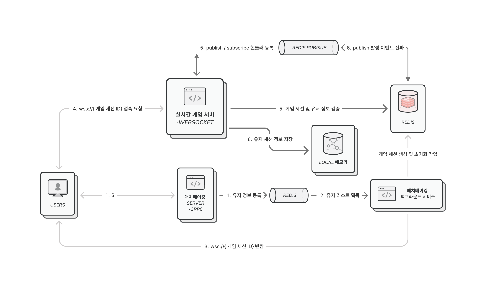

# 백엔드 개발자 김도훈

## Backend Developer Portfolio

### 분산 기반 실시간 멀티플레이 게임

**GitHub:** https://github.com/opt-dohun/HaxWar

성능 목표치: 한 개의 인스턴스 당 1,000개의 게임 룸, 2,000명의 동시 접속 환경을 타깃으로 한 Stateless 기반 실시간 분산 서버.

---

## 전체 아키텍쳐 구조도



---

## 1. gRPC와 WebSocket 혼용 구성

### 기술적 고민
해당 프로젝트에서는 두 가지 통신 패턴이 존재하였습니다. 첫 번째는 매치메이킹처럼 요청-응답 구조의 단발성 통신이고, 두 번째는 인게임 명령처럼 빈번하게 발생하는 실시간 통신입니다. 두 패턴은 요구사항이 정확성과 스키마 안정성, 그리고 지연 시간과 연결 유지, 메시지 유연성 등으로 달랐기 때문에, 하나의 프로토콜로 통일하기보다 각 패턴에 가장 적합한 프로토콜을 선택하는 것이 전체 성능과 안정성을 높일 수 있다고 판단했습니다.

### gRPC를 선택한 이유 — 매치메이킹
매치메이킹은 다음과 같은 특징이 있다고 판단했습니다.
- 대기열 등록, 매칭 결과 수신 등 정형화된 요청-응답 구조
- 클라이언트-서버 간 데이터 전송 객체 규격이 명확해야 동작 오류를 방지 가능
- 연결이 짧고 빈번하지 않으며, 정확한 응답이 중요

이에 gRPC를 채택하여 Protobuf로 스키마를 선언하고, 서버와 클라이언트가 동일한 데이터 전송 객체를 사용하도록 강제했습니다. 이를 통해 스키마 불일치로 인한 오류를 원천 차단할 수 있었고, 서버 단방향 스트리밍을 활용해 매칭 완료 이후 필요한 상태 정보를 클라이언트에 전달하는 방식으로도 확장할 수 있다고 판단하였습니다.

### WebSocket을 선택한 이유 — 게임 세션
게임 세션은 다음과 같은 특징이 있다고 판단했습니다.
- 유닛 이동, 공격, 턴 종료 등 작은 크기의 명령을 빈번하게 송수신
- 빈번한 요청 특성상 연결을 오래 유지하는 편이 유리
- 지연에 민감하며, 하나의 연결에서 다양한 형태의 비정형 메시지를 처리해야 함

gRPC 양방향 스트리밍으로도 인게임 통신이 가능하지만, 이동, 공격, 스킬 등 규격이 서로 다른 비정형 메시지가 빈번하게 발생하는 환경에서는 Protobuf의 강력한 타입 체크가 오히려 걸림돌이 됩니다. 구체적으로는 Any 타입으로 바이너리 배열을 감싼 뒤 식별 코드에 맞춰 다시 역직렬화하는 이중 처리 비용이 발생할 것입니다.

반면 WebSocket은 수신된 버퍼에서 사전에 약속한 식별 코드 바이트만 읽어 명령의 타입을 확인하고, 나머지 페이로드는 타입에 따라 즉시 역직렬화할 수 있어 불필요한 오버헤드 없이 통신이 가능합니다. 이에 WebSocket을 게임 세션 통신에 가장 적합한 프로토콜로 판단했습니다.

---

## 2. 분산 환경 동기화 아키텍쳐 구성

```
[Client A] (Node 1 접속)         [Client B] (Node 2 접속)
[Game Server Node 1]             [Game Server Node 2]
      │                                │
      └─────────► [ Redis Store ] ◄────┘
             1. 직렬화된 상태 영속화
             2. 분산 락
             3. 이벤트 발행-구독 모델
```

### 문제
2,000명 이상의 대규모 사용자 수용을 위해서는 서버 수평 확장이 필수적입니다. 그러나 초기에는 각 서버가 게임 상태를 인메모리에 직접 보유하는 상태 유지 구조였기 때문에, 사용자가 서로 다른 서버 노드에 매칭될 경우 상태가 불일치하여 게임 진행이 불가능해지는 문제가 존재하였습니다.

### 행동
- 게임 세션의 전체 상태를 `ProtoBuf` 형식의 바이트(Byte) 데이터로 직렬화하여 Redis에 영속화하였습니다. 이를 통해 기존 Json에 텍스트 형식과 다르게 크기를 줄일 수 있었습니다.
- Redis에서 상태를 읽고 비즈니스 로직을 실행할 때, `SETNX` 명령과 만료 시간(TTL) 설정을 이용하여 분산 락을 구현하였습니다. 이를 통해 동시 접속한 클라이언트들 중 하나의 서버만이 접근할 수 있도록 하여 데이터의 원자성을 보장하였습니다.
- 기존 메시지 큐는 경쟁 소비자 모델로, 각 서버에 동일한 이벤트를 브로드캐스팅하는데 적합하지 않다고 판단하였고, Redis의 발행 구독 채널 구독자 모델을 활용하여 게임 내 모든 서버 노드에 동일한 이벤트가 실시간으로 전파되도록 구성하였습니다.
- Redis의 발행 구독 채널 구독자 모델은 메시지 재처리를 보장하지 않으므로, 각 서버 내부 메모리에 고정 크기의 `CircularBuffer`(원형 큐)를 구축하여 클라이언트 재접속이나 네트워크 순단 시 버퍼 크기 한도 내에서 유실된 이벤트를 복구하도록 구성하였습니다.

### 결과
이 구조를 통해 서버 1에 연결된 플레이어 A의 명령 결과가 서버 2에 연결된 플레이어 B에게도 동일한 이벤트로 지연 없이 전달되고, 분산된 환경에서도 동일한 게임 경험을 제공할 수 있었습니다.

---

## 3. 가비지 컬렉션 최적화 설계 작업

### 문제
2,000명 동시 접속 테스트에서 초당 수만 건의 수신/전송 패킷 처리로 인해 메모리 할당이 빈번하게 발생하는 문제가 발생하였습니다. 300초 부하 테스트 결과 2세대 Full 가비지 컬렉션이 7회 발생하여, 런타임 환경의 자원 정리 동작으로 인해 서버가 멈추는 현상이 발생할 수 있다는 것을 알게되었습니다.

### 접근
실시간 게임 서버에서는 매 요청마다 힙 영역에서 객체를 할당하고 폐기하는 구조를 제거하고, 기존에 선언한 버퍼를 재사용하거나 메모리 주소를 직접 참조하는 설계가 필요하다고 판단하였습니다. 또한, 주소와 범위만을 전달하는 연산을 통해 중간 객체의 생성을 최소화하여 0세대 가비지 컬렉션 발생 빈도를 낮추는 것이 중요하다고 생각했습니다.

### 행동
- 소켓 수신부에서 매번 새로운 바이트 배열을 선언하던 구조를 `ArrayPool`로 변경하였습니다. 버퍼를 메모리 풀에서 임대하고 사용 후 반납하는 방식으로 전환하여 0세대 가비지 컬렉션 발생 빈도를 낮추었습니다.
- 송신 측에서는 생성한 패킷을 `ArraySegment<byte>`대신 `Memory<byte>` 타입으로 페이로드의 메모리 주소를 직접 참조하여 전달함으로써 중간 객체가 생성되지 않도록 구축하였습니다.
- 수신된 메시지의 역직렬화 과정에서 `MemoryStream` 같은 중간 스트림 객체를 생성하지 않고, 버퍼의 일부 영역을 `ReadOnlySpan<byte>`로 직접 전달하는 고속 처리 경로를 구축하였습니다.

### 결과
부하 테스트 비교 결과 시스템 중단을 유발하는 2세대 가비지 컬렉션 발생 횟수를 7회에서 1회로 85.7% 감소시켰으며, 평균 지연 시간을 0.03ms로 최적화하였습니다. 2,000 세션 활성화 상태에서도 실제 서버의 가비지 컬렉션 힙 크기를 97.89MB로 방어하여, 장시간 구동에도 안정적인 성능을 유지하는 것을 확인하였습니다.


---

## 최적화 전후 성능 데이터 비교

1,000개 게임방(2,000 클라이언트)을 대상으로 아래 로드 테스트 명령을 실행하여 수집한 결과입니다.

```bash
docker compose up --build -d

dotnet run -c Release --project tests/HexWar.LoadTests -- http://localhost:5020 1000 300
```

| 측정 메트릭 | 최적화 이전 (300초) | 최적화 이후 (300초) | 성능 개선 효과 |
| --- | --- | --- | --- |
| **서버 0세대 가비지 컬렉션** | 47회 | **6회** | 87.2% 감소 |
| **서버 1세대 가비지 컬렉션** | 14회 | **2회** | 85.7% 감소 |
| **서버 2세대 가비지 컬렉션** | 7회 | **1회** | 85.7% 감소 |
| **서버 가비지 컬렉션 힙 크기** | 약 232.8 MB | **97.89 MB** | 57.9% 메모리 절약 |
| **세션당 메모리** | 약 116 KB | **50.12 KB** | 56.8% 세션 경량화 |
| **평균 이동 명령 지연** | 0.04 ms | **0.03 ms** | 25% 지연 단축 |
| **지연 상위 99%** | 0.11 ms | **0.08 ms** | 27.2% 대기 시간 단축 |
| **송신 메시지 처리량** | 14,333건 | **18,000건** | 25.5% 처리량 향상 |
| **수신 메시지 처리량** | 52,985건 | **67,846건** | 28.0% 처리량 향상 |

---

> [!IMPORTANT]
**부하 테스트 지표와 실제 서버 지표의 분리**
 
부하 테스트 리포트 하단의 `SERVER RESOURCE` 항목은 실제로는 부하 테스트 클라이언트 프로세스 자체의 리소스입니다. 실제 게임 서버의 성능 지표는 Docker 컨테이너 내부 진단 API(`/api/diagnostics/stats`)를 통해 별도로 측정하였으며, 위 표의 최적화 이후 수치는 이 실제 측정값입니다.

---

## 4. Nginx 및 OS 설정을 통한 TCP 커넥션 최적화

### 문제
 Nginx의 액세스 로그 상에서 클라이언트가 응답 지연으로 인해 연결을 강제로 종료하는 `499 Client Closed Request` 에러와 함께 트래픽 유실이 발생하는 현상을 확인하였습니다. 이는 Nginx의 기본 `worker_connections` 제한(1024) 과 디스크립터 한도(`nofile`) 설정으로 인해 다수의 연결을 수용하지 못하는 구조적 한계가 존재하는 것으로 판단하였습니다.

### 행동
- Nginx 설정에서 CPU 코어 수에 맞춰 프로세스를 자동 지정하는 `worker_processes auto`를 사용하고 워커당 동시 커넥션 한도를 10240으로 설정하였습니다. 웹소켓 프록싱 환경에서는 단일 클라이언트 연결 요청 시 [클라이언트↔Nginx] 및 [Nginx↔백엔드]의 2개 소켓 연결이 쌍으로 소모되므로, 워커당 실질적인 클라이언트 동시접속 수용 한계는 `worker_connections`의 절반 수준인 **최대 5,120개**가 됩니다. 이에 따라 워커가 최대 커넥션 한계(10,240개)에 부딪히기 전에 파일 디스크립터(FD) 고갈이 발생하지 않도록 프로세스 FD 상한(`worker_rlimit_nofile`)을 2배 수준인 20480으로 지정하여 소켓 자원 부족 현상을 예방하였습니다.
- Docker 컨테이너의 TCP 연결 관련 커널 설정을 수정하였습니다.
  - `net.core.somaxconn = 65535`: TCP Accept Queue의 최대 길이를 늘려 연결 폭증 시 SYN 패킷이 드롭되지 않도록 설정
  - `net.ipv4.tcp_max_syn_backlog = 8192`: SYN Queue 크기를 확장하여 3-way-handshake 완료 전 대기 중인 연결 요청의 유실을 방지
  - `net.ipv4.ip_local_port_range = 1024 65000`: nginx 뒤편의 서버와 연결을 진행할떄의 번호 대역을 확장하여 백엔드 서버와 통신 시 포트 고갈 현상을 방지하였습니다.
  - `net.ipv4.tcp_tw_reuse = 1`: 기존 TIME_WAIT 상태를 통해 통신 종료 이후에도 소켓을 일정 시간 유지하는 구조에서 연결 요청 시 소켓을 재사용을 허용하도록 설정하였습니다.

### 최적화 이후 성능 지표
```bash
# 1. 인프라 컨테이너 구동
docker compose up -d --build

# 2. 2,000명 동시접속 부하 테스트 수행 (1,000개 게임방, 60초)
dotnet run -c Release --project tests/HexWar.LoadTests -- http://localhost:5020 1000 60

# 3. Nginx 예외 및 에러 로그 검증
docker logs hexwar-nginx 2>&1 | grep -iE "error|crit|alert|emerg|warn"
```

#### 동시접속 규모별(2,000명 vs 4,000명) 실제 테스트 검증 지표
| 측정 메트릭 | 2,000명 부하 (1,000개 방) | 4,000명 부하 (2,000개 방) | 기술적 검증 의미 |
| --- | --- | --- | --- |
| **연결 성공률** | **100% (2,000/2,000)** | **100% (4,000/4,000)** |  |
| **502 Bad Gateway 에러율** | **0% (0건)** | **0% (0건)** | 4000명 총 8000개의 FD 가량 생성되었음에도 연결 오류 발생 방지 확인 |
| **평균 이동 지연 시간** | **0.00 ms (P99 0.02 ms)** | **0.01 ms (P99 0.01 ms)** | 연결 수 증가에도 지연시간의 급증은 발생하지 않음  |

