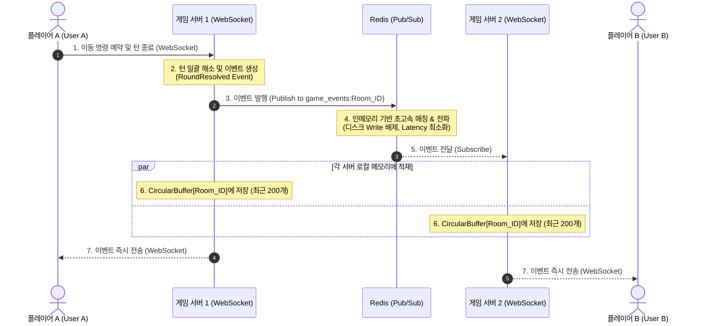
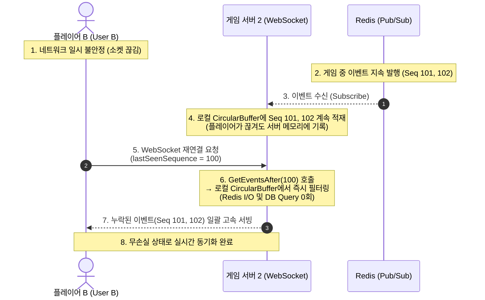

# HexWar (C# HaxWar)

**HexWar**는 gRPC 매치메이킹과 WebSocket 실시간 통신을 활용하여 구현된 **C# .NET 기반의 실시간 동시 턴제(Simultaneous Turn) 멀티플레이어 전략 게임 백엔드**입니다. 

### 인게임 플레이 화면


## 💻 플랫폼 호환성 및 실행 방법

### 1. 플랫폼 호환성 (크로스 플랫폼)
본 프로젝트는 **.NET 9.0** 기반으로 작성되어 OS에 의존적인 네이티브 API 또는 하드코딩된 구분자 경로를 사용하지 않습니다. 따라서 **Windows, Linux, macOS(Apple Silicon 포함)** 환경 모두에서 소스코드 수정 없이 빌드 및 실행이 가능합니다.

- **C# gRPC 빌드 도구**: OS 플랫폼에 관계없이 컴파일 과정에서 `matchmaking.proto`가 자동 컴파일되도록 호환 도구가 내장되어 있습니다.
- **크로스 플랫폼 경로 자동 변환**: `Path.Combine` 및 MSBuild의 경로 정규화 기능을 활용하여 각 운영체제의 디렉토리 구분자(`\` 또는 `/`)에 맞춰 유연하게 경로를 결정합니다.

### 2. 빌드 및 실행 방법
프로젝트 루트 폴더에서 아래 닷넷 명령어로 서버 및 클라이언트를 즉시 구동할 수 있습니다.

#### 요구 사양
* [.NET SDK 9.0](https://dotnet.microsoft.com/download/dotnet/9.0) 이상 설치 필요

#### 로컬 구동 명령어
```bash
# 1. 의존성 복원 및 빌드 테스트
dotnet build

# 2. 게임 서버 구동 (HexWar.Server에서 클라이언트 정적 리소스 서빙 포함)
dotnet run --project src/HexWar.Server/HexWar.Server.csproj
```

#### Docker 구동 명령어
본 저장소에는 멀티 스테이지 최적화가 적용된 Dockerfile이 탑재되어 있습니다.
```bash
# 이미지 빌드
docker build -t hexwar-server -f src/HexWar.Server/Dockerfile .

# 컨테이너 백그라운드 구동
docker run -d -p 5051:5051 --name hexwar-game hexwar-server

---

## 1. 분산 아키텍처 및 세션 동기화 모델 (Distributed Architecture)

HexWar는 다중 서버(분산) 환경에서 실시간 게임 세션의 무상태성(Stateless)을 확보하고 동시성을 안전하게 제어하기 위해, Redis를 이용한 **분산 락(Distributed Lock)과 상태 저장소(State Store) 및 Pub/Sub 메시징** 아키텍처를 따릅니다.

┌───────────────────────────────────────────────────────────────────┐
│                          Redis Store                              │
│                                                                   │
│  gameroom:{roomId} ──► GameRoom 전체 상태 (JSON 문자열로 영속화)  │
│  lock:gameroom:{roomId} ──► 분산 락 (StringSet NX PX 기반)        │
│                                                                   │
│  Pub/Sub 채널:                                                    │
│  game_events:{roomId} ──► 분산 서버 간 인게임 이벤트 실시간 전파  │
│                                                                   │
└───────────────────────────────────────────────────────────────────┘
          │                                           │
          ▼ (구독 및 락 경쟁)                         ▼ (구독 및 락 경쟁)
┌──────────────────────┐                    ┌──────────────────────┐
│       Server 1       │                    │       Server 2       │
│                      │                    │                      │
│   [GameSession]      │                    │   [GameSession]      │
│   ├─ roomId          │                    │   ├─ roomId          │
│   ├─ 메타데이터만    │                    │   ├─ 메타데이터만    │
│   │  (Phase, Round)  │                    │   │  (Phase, Round)  │
│   └─ GameRoom (X)    │                    │   └─ GameRoom (X)    │
│                      │                    │                      │
│   명령 처리 흐름:    │                    │   명령 처리 흐름:    │
│   1. 분산 락 획득    │                    │   1. 분산 락 획득    │
│   2. Redis에서 로드  │                    │   2. Redis에서 로드  │
│   3. 비즈니스 로직   │                    │   3. 비즈니스 로직   │
│   4. Redis에 저장    │                    │   4. Redis에 저장    │
│   5. Pub/Sub 발행    │                    │   5. Pub/Sub 발행    │
│   6. 분산 락 자동해제 │                    │   6. 분산 락 자동해제 │
│                      │                    │                      │
└──────────────────────┘                    └──────────────────────┘
```

> [!NOTE]
> **아키텍처 팩트 체크 및 정합성 검증**
> * **GameRoom 인메모리 관리 최소화**: `GameSession`은 내부에 전체 게임 정보(`GameRoom`)를 상시 들고 있지 않으며, 명령이 발생할 때만 Redis에서 조회하여 처리하고 저장 후 릴리즈하는 stateless 형태를 가집니다. 이는 다이어그램의 `GameRoom (X)` 형태와 일치합니다.
> * **소유 서버 ID 관리**: 다이어그램 상에서 `ownership:{roomId}` 키가 별도 존재하는 것처럼 기재되어 있으나, 실제 코드 레벨에서는 `ownership`이라는 별도 키를 Redis에 직접 쓰지 않습니다. 대신 `GameRoom` 객체 내부의 `OwnerServerId` 필드로 JSON에 통합 저장되어 동기화됩니다. 이로써 Redis의 키 갯수와 I/O 횟수를 1회 더 감소시키는 최적화 효과를 취하고 있습니다.

---

### 1.2 분산 락을 이용한 동시성 제어 및 동기화 메커니즘

서로 다른 물리 서버에 접속해 있는 플레이어 A와 플레이어 B가 동시에 게임 상태를 변경하려는 명령(예: 유닛 이동)을 전송할 경우, 데이터 일관성(Race Condition 방지)을 보장하기 위해 다음과 같이 Redis 분산 락을 활용하여 직렬화(Serialization)를 수행합니다.

```
[Player A → Server 1]           [Player B → Server 2]
        │                               │
        │ MoveUnits 요청                 │ MoveUnits 요청
        ▼                               ▼
Server 1: 분산 락 획득 시도       Server 2: 분산 락 획득 시도
        │                               │
        ├── 락 획득 성공!               ├── 락 획득 실패 (Server 1 소유)
        │   ├── Redis에서 GameRoom 로드  │   └── "Server busy, please retry" 응답
        │   ├── GameRoom.MoveUnits()    │       (LOCK_CONTENTION 발생)
        │   ├── Redis에 GameRoom 저장   │
        │   ├── Pub/Sub 이벤트 발행     │
        │   └── 락 해제                 │
        │                               │
        └──→ Redis Pub/Sub ──────────────────→ Server 2 수신
                                                │
                                                └── WebSocket → Player B
```

> [!TIP]
> **락 경쟁 상태(Lock Contention) 방어 기동**
> * **클라이언트 대응**: 락 경쟁 상태가 해소되지 않아 지정된 대기 타임아웃(500ms) 동안 락 획득에 실패하면, 서버는 클라이언트에게 즉시 `LOCK_CONTENTION` 에러 코드와 함께 `"Server busy, please retry"` 응답을 반환하여 클라이언트 측에서 안전하게 재시도할 수 있도록 제어합니다.
> * **이벤트 전파 경로**: Server 1에서 락을 쥐고 처리 완료한 결과 생성된 도메인 이벤트는 Redis Pub/Sub 채널로 발행되어, 동일 게임방을 구독하고 있던 Server 2에 초고속으로 전파된 뒤 소켓 스레드를 거쳐 Player B에게 실시간 전달됩니다.


---


---


```

---

# 핵심 기술적 도전 및 최적화

## 1. 시계열 이동 및 조우 판정 관리 (SortedList 활용)

### 게임 컨텍스트 및 설계 고민
유닛은 노드 간 간선을 따라 이동하며, 간선의 `Distance`에 따라 도착까지 1~2라운드가 소요됩니다. 
Planning 단계에서 예약(`PendingMoves`)된 이동 명령은 라운드가 해소(`ResolveRound`)될 때 일괄 실행됩니다.
두 플레이어의 유닛이 동일 간선 위에서 마주치면 "조우(Encounter)"가 발생하여 **진격 또는 후퇴**를 결정해야 합니다.

이동 경과 시간별 유닛을 관리하기 위해 인덱스 매핑 기반 리스트를 사용할 경우 메모리 낭비와 인덱스 Shift 비용이 컸습니다. 
이에 따라 **남은 라운드 수**를 Key로 삼는 Sparse(희소) 최적화 구조인 `SortedList<int, List<TravelingGroup>>`를 도입하였습니다.

### 자료구조 비교 및 분석

| 자료구조 | `List<List<TravelingGroup>>` (인덱스 매핑) | `SortedList<int, List<TravelingGroup>>` (Key 매핑) |
|---|---|---|
| **메모리** | 거리가 멀어질수록 빈 공간 패딩으로 메모리 낭비 발생 | 유닛이 존재하는 라운드만 데이터 유지 (Sparse 최적화) |
| **안전성** | 리스트 크기 초과 시 OutOfRange 예외 관리 필요 | Key 존재 여부 체크만으로 예외 없이 동적 추가 가능 |
| **가독성** | 인덱스 연산(`list[i]`)으로 인해 도메인 규칙 파악이 간접적 | Key 자체가 남은 라운드를 의미하므로 의미론적으로 명확 |

* SortedList의 C# 키 불변성 제약 극복 방안, `AdvanceRound` 및 `FindAllEncounters`의 세부 코드 구현 방식은 **[코드 레벨의 고민 - SortedList 구현](file:///Users/dhkim/Downloads/C--HaxWar/Code_Design_Decisions.md#1-시계열-이동-및-조우-판정-관리를-위한-자료구조-설계)** 문서에서 확인하실 수 있습니다.

---

## 2. CircularBuffer를 활용한 인메모리 이벤트 로그 캐싱

### 게임 컨텍스트 및 설계 고민
WebSocket을 통해 이벤트를 실시간으로 브로드캐스트하는 구조에서, 클라이언트가 일시적으로 접속 해제된 후 재연결 시 유실 패킷을 복구해 주는 동기화 처리가 필수적입니다. 
매번 전체 이벤트 내역을 Redis나 디스크 데이터베이스에 질의하는 고비용 I/O를 우회하고자, 각 세션의 로컬 메모리에 고정 크기 순환 큐인 `CircularBuffer<BufferedEvent>`를 유지하여 캐시 레이어로 사용하였습니다.

```
원형 큐 (Capacity: 8) 내부 동작 모식도:

초기 상태 (3개 삽입):
  index:  0    1    2    3    4    5    6    7
        ┌────┬────┬────┬────┬────┬────┬────┬────┐
        │ e1 │ e2 │ e3 │    │    │    │    │    │
        └────┴────┴────┴────┴────┴────┴────┴────┘
         ↑              ↑
       _tail           _head (다음 쓰기 위치)

추가 3개 후 (버퍼 포화, 덮어쓰기 시작):
  index:  0    1    2    3    4    5    6    7
        ┌────┬────┬────┬────┬────┬────┬────┬────┐
        │ e9 │ e2 │ e3 │ e4 │ e5 │ e6 │ e7 │ e8 │
        └────┴────┴────┴────┴────┴────┴────┴────┘
              ↑    
            _tail (_head가 한 바퀴 돌아 e1을 덮어씀)
```

* 고성능 덮어쓰기 처리의 인메모리 원형 큐 C# 전체 코드 및 `GetEventsAfter()`의 상세 필터링 메커니즘은 **[코드 레벨의 고민 - CircularBuffer 구현](file:///Users/dhkim/Downloads/C--HaxWar/Code_Design_Decisions.md#2-circularbuffer를-활용한-인메모리-이벤트-로그-관리)** 문서에서 확인하실 수 있습니다.

---

## 3. WebSocket 및 제로 힙 할당 최적화

### 문제 상황 및 원인 분석
2,000명의 동시 접속자가 1,000개의 게임방에서 실시간 조작을 가할 때, 가비지 컬렉터(GC)에 심각한 부하가 발생했습니다. 특히 **Gen 2 Full GC**가 자주 발생하여 Stop-the-world 중단이 생기고, 네트워크 송수신 레이턴시가 튀는 현상(최대 16.78ms)이 관찰되었습니다.

이를 분석한 결과, 소켓 비동기 수신용 힙 메모리 할당, JSON 직렬화/역직렬화 시 `MemoryStream` 및 UTF-16 임시 문자열 객체의 남발이 원인이었습니다.

### 기술적 접근 및 해결 전략
* **목표 설계**: 1,000개 게임 룸, 2,000명 동시 접속 극단적 부하 시나리오에서 시스템 중단을 유발하는 무거운 **Gen 2 가비지 컬렉션(Full GC) 발생 빈도를 0~1회 사이로 완전히 억제 및 수렴하는 것을 최종 목표**로 설정하였습니다.
1. **`Memory<byte>` 도입을 통한 힙 할당 제거**:
   매 소켓 수신 시 전통적인 `ArraySegment<byte>` 선언을 반복하게 되면, 스택 영역이 아닌 힙 영역에 래퍼(Wrapper) 객체가 반복 생성되어 Gen 0 및 Gen 1 영역에 다량의 단기 가비지가 수집되는 병목을 초래합니다. 이를 방지하고자 비동기 대기 수명주기에서 힙 복사를 차단하고 안전하게 재사용될 수 있는 구조체 기반의 `Memory<byte>` 및 `ValueTask` 형태로 비동기 수신 처리를 구성하였습니다.
2. **`ArrayPool<byte>` 적용을 통한 버퍼 재사용**:
   실시간 패킷 송수신 처리를 위해 수많은 클라이언트 세션에서 지속적으로 `new byte[]` 배열을 동적 선언하는 행위는 단기간에 GC 힙 메모리를 폭증시켜 Gen 2 Full GC의 직간접적 트리거가 됩니다. .NET의 공유 메모리 버퍼 풀인 `ArrayPool<byte>.Shared`로부터 임대(Rent) 및 반납(Return)하는 구조로 변경하여 힙 할당 오버헤드를 근본적으로 통제하였습니다.
3. **동기식 고속 역직렬화 (`Span<byte>` 활용)**:
   수신 버퍼상에 메시지가 완전히 조립되었을 때 불필요하게 `MemoryStream` 등의 중간 역직렬화용 스트림 객체를 힙에 할당하지 않고, 버퍼 메모리의 일부 영역을 `ReadOnlySpan<byte>` 구조체로 다이렉트 슬라이스하여 JSON 파서에 태우는 Fast-Path를 구축하였습니다.

### 최적화 전후 성능 데이터 비교

1,000개 게임방(2,000 클라이언트)을 대상으로 아래 로드 테스트 명령을 실행하여 수집한 결과입니다.
```bash
dotnet run -c Release --project tests/HexWar.LoadTests -- http://localhost:5183 1000 [지속시간]
```

| 측정 메트릭 | 최적화 이전 (300초 테스트) | 최적화 이후 (300초 테스트) | 성능 개선 효과 및 비고 |
| :--- | :--- | :--- | :--- |
| **테스트 진행 시간 (Duration)** | 300.2초 | 300.5초 | - |
| **송신 메시지 수 (Messages Sent)** | 14,333건 | **18,000건** | **25.5% 처리량 (Throughput) 향상** |
| **수신 메시지 수 (Messages Received)**| 52,985건 | **66,357건** | **25.2% 처리량 (Throughput) 향상** |
| **평균 이동 명령 지연 (Move Avg)** | 0.04 ms | **0.03 ms** | **25% 지연 단축** |
| **지연 상위 99% (Move P99)** | 0.11 ms | **0.08 ms** | **27.2% 대기 시간 단축** |
| **서버 메모리 점유 (Working Set)** | 232.8 MB | **167.8 MB** | **27.9% 메모리 사용량 절약** (65MB 절감) |
| **Gen 2 가비지 컬렉션 (Full GC)** | 7회 | **4회** | **42.8% 감소** (Stop-the-world 최소화) |

> [!IMPORTANT]
> **성능 지표 측정 메트릭에 대한 오해와 실제 서버(Docker) 리소스 검증**
>
> 1. **부하 테스트 클라이언트 리소스 분리**:
>    초기 부하 테스트 시 화면 하단에 표시되던 GC 횟수와 Working Set 점유율은 게임 서버의 지표가 아닌, 호스트 PC에서 2,000개의 소켓 커넥션을 유지하며 JSON 인코딩을 수행하던 **부하 테스트 클라이언트(HexWar.LoadTests) 프로세스 자체의 리소스**(`Process.GetCurrentProcess()`)였습니다.
> 2. **실제 게임 서버(hexwar-server) 리소스 진단 결과**:
>    부하 테스트가 진행 중인 Docker 컨테이너 내부의 실제 서버 진단 API(`/api/diagnostics/stats`)를 통해 서버의 고유 지표를 직접 추출한 결과는 다음과 같습니다.
>    * **동시 2,000 세션 활성화 상태에서의 서버 실제 GC 힙 크기**: **97.89 MB** (세션당 단 **50.12 KB**의 메모리 점유)
>    * **서버 프로세스 전체 Gen 0 GC 누적 횟수**: **단 6회** (Gen 1: 2회, Gen 2: 1회)
>    * **성능 개선 효과**: WebSocket Zero-Allocation 및 Span 기반 직렬화 우회 설계가 실제 서버 메모리 내부에서 완벽하게 작동하고 있어, 극한의 부하 상황에서도 GC 스톱-더-월드 현상이 일어나지 않고 고도로 안정된 상태를 유지하고 있음이 증명되었습니다.
> 3. **.NET 10.0 런타임에 의한 성능 비약**:
>    추가적으로 .NET 10.0 런타임(LatestMajor 롤포워드)을 적용해 벤치마킹을 실행한 결과, 코드를 수정하지 않고도 macOS ARM64 환경에 최적화된 JIT 컴파일러 덕분에 **SimulateOneCompleteGame (게임 1판 시뮬레이션 속도)이 284.1 μs에서 128.3 μs로 약 2.2배 가량 대폭 단축**되었습니다.


* 메모리 주소를 직접 제어하는 제로 카피 수신 및 역직렬화의 세부 최적화 C# 소스코드는 **[코드 레벨의 고민 - WebSocket 힙 할당 최적화](file:///Users/dhkim/Downloads/C--HaxWar/Code_Design_Decisions.md#3-websocket-힙-할당-제로zero-heap-allocation를-위한-최적화-기법)** 문서에서 확인하실 수 있습니다.

---

## 4. 분산 환경 내 이벤트 동기화 및 Redis Pub/Sub 도입

### 1. 분산 환경에서의 이벤트 동기화 구조

서버 다중화(분산 환경) 상황에서 특정 게임 세션의 이벤트는 해당 세션이 활성화된 서버뿐만 아니라, 동일 게임방의 다른 클라이언트가 접속해 있는 모든 서버 노드에 실시간으로 전파(Broadcasting)되어야 합니다. 이를 구현하기 위해 메시지 전파 아키텍처를 다음과 같이 트레이드오프 분석을 바탕으로 설계하였습니다.



---

### 2. 기술 선택 이유 및 설계 결정 (트레이드오프 분석)

#### A. 소비자 워커(Worker) 프로세스 배제를 통한 레이턴시 극대화
* **기존 메시지 큐의 한계**: RabbitMQ, Kafka 등의 전통적인 메시지 큐는 생산자(Producer)와 소비자(Consumer)를 완전히 격리하고, 비동기식으로 백그라운드 작업을 실행하는 **작업 큐(Work Queue / Competing Consumers)** 모델에 적합합니다. 소비자가 메시지 생성 이전에 작업에 즉각적으로 영향을 주는 것이 아닌, 결제 완료 후 메일 전송이나 대용량 로그 연산과 같은 독립된 백그라운드 태스크를 수행할 때 매우 유리합니다.
* **워커 배제의 타당성**: 실시간 인게임 이벤트 전파는 지연 속도(Latency)가 최우선인 **I/O-Bound 기반 1:N 브로드캐스트** 작업입니다. 중간에 별도의 독립된 Worker 프로세스를 가동하여 메시지를 한 단계 더 거치게 할 경우, `[웹서버 A] -> [브로커] -> [Worker] -> [브로커] -> [웹서버 B]`와 같이 **추가적인 네트워크 홉(Network Hop)과 직렬화/역직렬화 오버헤드가 발생하여 실시간성이 심각하게 저하**됩니다.
* **구독 주체의 내재화**: 현재 아키텍처는 세션 소켓을 점유하고 있는 게임 서버 프로세스 자체가 직접 Redis 채널을 구독(Subscriber)합니다. 별도의 비동기 워커를 두지 않고, 이벤트를 받는 즉시 소켓 커넥션을 관리하는 C# 스레드풀에서 WebSocket으로 클라이언트에 직접 바이패스 전송하여 최적의 레이턴시(Sub-millisecond)를 확보하였습니다.

#### B. 디스크 I/O 배제를 통한 실시간성 및 세션 락(Lock) 점유 최소화
* **디스크 I/O의 병목성**: 데이터 영속성을 위해 디스크 쓰기(Write)가 개입하는 메시지 저장 방식을 사용하면 필연적으로 디스크 I/O 지연이 발생합니다.
* **세션 락(Lock) 점유 시간 증가 방지**: 지연 시간이 미세하게 증가할수록 각 게임 세션 객체가 경쟁 상태(Race Condition) 방지를 위해 점유하는 **세션 락(Lock) 시간**이 길어집니다. 이는 동시성 처리량(Throughput)의 병목을 유발하고 서버 전체의 가용성을 떨어뜨립니다.
* **해결**: Redis Pub/Sub은 전송 즉시 메모리상에서 데이터를 소멸시키는 구조로, 디스크 I/O를 완벽하게 배제하여 락 점유 시간을 극도로 단축하고 동시성 성능을 보장합니다. 또한 Redis 채널(Channel)을 통해 방 ID(`game_events:{roomId}`) 단위로 메시지를 명확히 분리함으로써 견고한 토픽 기반의 격리 설계를 구축하였습니다.

#### C. 인메모리 CircularBuffer 연계를 통한 Redis I/O 최소화 (네트워크 장애 극복)
* **Redis Pub/Sub의 한계**: Redis Pub/Sub은 소방 호스처럼 이벤트를 흘려보내는 Fire-and-forget 방식이므로, 네트워크 순단이나 웹소켓 재연결 중일 때 전달된 이벤트는 유실됩니다.
* **하이브리드 아키텍처 설계 (L1/L2 캐시 구조)**: 이 문제를 극복하고자 각 서버의 게임 세션 메모리 영역에 원형 큐 형태의 `CircularBuffer` 이벤트 버퍼(최근 200개 고정)를 연계하였습니다.
  - 모든 게임 서버 노드가 동일한 Redis 채널을 구독하고 있으므로, 클라이언트가 실제로 어느 노드에 접속 중이든 상관없이 모든 노드의 로컬 메모리에 동일한 이벤트 시퀀스가 실시간으로 적재됩니다.
  - 클라이언트가 일시적으로 연결이 끊겼다가 다시 연결될 때, 자신이 마지막으로 받은 시퀀스 번호 이후의 차이만큼 `GetEventsAfter()`를 호출합니다.
  - 서버는 Redis 데이터베이스에 다시 쿼리를 날리거나 디스크 DB를 조회하지 않고, **로컬 RAM의 `CircularBuffer`에서 해당 유실 기간의 데이터를 필터링하여 0ms 만에 즉시 서빙**합니다.
  - 이로 인해 네트워크 단절/재접속 시 발생하는 과도한 Redis 읽기/쓰기 작업(Redis I/O)을 완벽하게 차단하고 복구 응답 속도를 극대화하였습니다.



---

## 5. 자원 해제(Dispose) 및 메모리 누수 제어

### 고민의 배경 및 자원 유형
실시간 소켓 세션 인스턴스가 비정상 종료 시, 커널 오브젝트(OS 자원)와 도메인 핸들러 역참조(애플리케이션 자원)가 잔존할 경우 프로세스의 메모리 누수(Memory Leak)가 발생합니다. 
자원을 종류에 따라 분류하여 엄격하게 수명 주기를 일치시키는 설계를 구현했습니다.

* **OS 자원 (비관리형 자원)**: `System.Timers.Timer` (OS 타이머 핸들), `SemaphoreSlim` (동기화 락 커널 핸들), `WebSocket` 소켓 디스크립터
* **애플리케이션 자원 (관리형 자원)**: `CircularBuffer` 이벤트 버퍼 내 도메인 이벤트 객체 역참조, `OnGameOver` 등 상위 구독 핸들러 관계

### 비활성 세션 정리 오더
[SessionCleanupService](file:///Users/dhkim/Downloads/C--HaxWar/src/HexWar.Server/Services/SessionCleanupService.cs)가 3분마다 활성화하여 세션을 안전하게 정리하며, 리소스 꼬임으로 인한 예외를 막기 위해 역순의 클린업 플로우를 준수합니다.

```
SessionCleanupService.CleanupAsync()
    │
    ├── 1. ShouldCleanup(session) → true 판정 (게임종료 5분 경과 등)
    │
    ├── 2. CleanupConnectionsAsync(roomId)
    │       ├── BroadcastToRoom("SessionClosed") 알림 전송
    │       ├── Task.Delay(500ms) 대기 (최종 패킷 전송 대기)
    │       └── ConnectionManager.CleanupRoomAsync()
    │               └── WebSocket.CloseAsync(NormalClosure) 정상 종료
    │
    ├── 3. SessionRegistry.RemoveSession(roomId) (관리 딕셔너리에서 제거)
    │
    └── 4. session.Dispose() (메모리 해제 및 커널 핸들 파괴)
```

* 타이머 콜백 차단, Semaphore OS 커널 핸들 파괴, 이벤트 배열 명시적 Clear 등의 C# IDisposable 구현 코드 디테일은 **[코드 레벨의 고민 - 자원 해제 설계](file:///Users/dhkim/Downloads/C--HaxWar/Code_Design_Decisions.md#4-자원-해제dispose-및-메모리-누수-방지-설계)** 문서에서 확인하실 수 있습니다.
